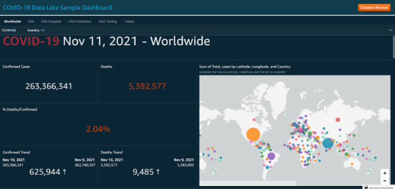
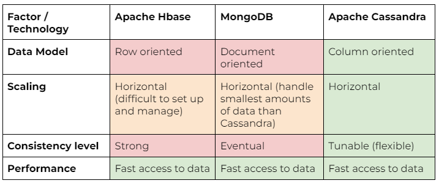
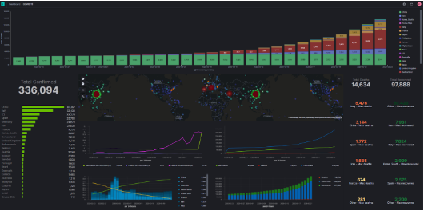
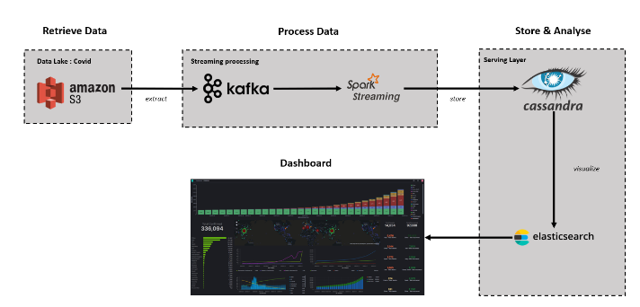

# BigDataEcoSystem_project_Burah_Demeure_Meunier

## Detailed description of the use case

With the arrival of the COVID BF.7 virus, France will have to recover a maximum of data concerning it in order to help public health officials and policymakers to identify areas where the virus is spreading rapidly and take necessary measures to slow or stop its transmission. This could include implementing social distancing measures, issuing quarantine orders or ramping up testing and contact tracing efforts.

They will also need these COVID BF.7 data to inform economic and social policies. For example, data on the spread of the virus can be used to help determine which sectors of the economy are most impacted and to develop targeted economic relief measures. It can also be used to inform decisions about school closures and remote learning, as well as to identify vulnerable populations that may require additional support.

Finally, COVID BF.7 data will be used for research purposes. By studying the spread and impact of the virus, scientists and researchers can gain a better understanding of how it spreads, how it affects different populations and how it can be prevented or treated. This research can help inform the development of vaccines, treatments and other interventions to combat the virus. 

COVID-19 data is published from many distinct sources with highly heterogeneous formats. The goal of this pipeline is to accept data in many different formats and to process it into a standardized and consistent schema. Having data in a consistent schema allows researchers to build models quickly, while the pipeline is designed for engineers to add new data sources quickly. We'll use multiple tools to collect and extract data, we'll present these items in the next part. 

We'll also use a visualisation tool because visualisation is important for COVID-19 data. It allows the data to be presented in a clear and easily understandable format. Visualisations such as charts, graphs and maps can help to identify patterns and trends in the data and inform decision-making about public health interventions. Visualisations can also be used to communicate complex data to a wide audience, making it easier for people to understand the magnitude of the problem and the impact of different interventions.

## Presentation of all the technologies
### Amazon S3

<ins> What is Amazon S3? </ins>
Amazon S3 (Simple Storage Service) is a cloud storage service provided by Amazon Web Services. It allows users to store and retrieve large amounts of data, such as documents, images, and videos, from anywhere on the web.

It is designed to be highly durable. It can  store data redundantly across multiple servers and locations. It is perfect for  storing data that needs to be available at all times, even in the event of a server failure.

S3 is also highly scalable, meaning that it can easily handle a large volume of data and a high number of requests. It is often used for applications that require fast, reliable access to data, such as websites, mobile apps, and analytics platforms.

Finally,  this technology charges users based on the amount of data they store and the number of requests they make. So, consumers pay only for what they use which is a cost-effective option.

<ins> Amazon S3 (data lake) </ins>

<ins> What is Amazon S3 used for? </ins>
*__Storing and backing up data:__* Amazon S3 is often used to back up data and to store large amounts of data that is used for analytics and machine learning applications.

*__Storing and sharing files:__* It can be used as a file storage and sharing service. Thanks to it, users are able to upload, download and share files with others.

*__Integration with other AWS services:__* S3 is flexible. It can integrate with a wide range of other AWS services, such as Amazon EC2, Amazon RDS, and Amazon EMR. It allows users to easily build and deploy cloud-based applications. 

*__Data security:__* It provides a number of security features, including data encryption, access controls, and audits, to help protect data from unauthorized access or tampering.

*__Hosting static websites:__* Amazon S3 can be used to host static websites (websites built only with HTML, CSS, and JavaScript files). This is often a cost-effective alternative to hosting a website on a traditional web server.

<ins>What are the technologies similar to Amazon S3?</ins>
We found 3 other technologies: 
* Microsoft Azure Blob Storage
* Google Cloud Storage
* IBM Cloud Object Storage

They all are object storage services provided by Microsoft, Google Cloud and IBM respectively. They are all designed to store and retrieve large amounts of data, and can be easily integrated with other Azure services, Google Cloud services and IBM Cloud service.

### Kafka
To process the data, we have hesitated between batch or stream processing, so we decided to analyse the requirements of the use case and compare the use of both techniques.

Here are a few factors to consider when deciding between batch and stream processing for a data pipeline on COVID-19:
*__Data volume and velocity:__* If we are dealing with large volumes of data and need to process it quickly, stream processing might be a better choice. If we are dealing with smaller volumes of data or don't need real-time processing, batch processing might be a good choice.

*__Data sources:__* If we are collecting data from multiple sources, such as social media, sensor data, or databases, stream processing might be a good choice. If you are collecting data from a single source, or if the data is generated periodically, batch processing might be a better choice.

*__Data analysis:__* If we need to perform real-time analysis of data streams, such as detecting trends or anomalies, stream processing might be a good choice. If we are more concerned with offline analysis of large datasets, batch processing might be a better choice.

For our use case, we want to do real time analytics, so we decided to use streaming processing using kafka, because we want to build a data pipeline that requires real time stream processing data.

<ins>What is Apache Kafka? </ins>
Apache Kafka is an open-source stream processing platform that is used for building real-time data pipelines and streaming applications. It is designed to handle high throughput, low latency, and scalable data streams. Kafka can be used to ingest data from a variety of sources in real-time and transmit it to other systems for further processing.

Kafka is based on a distributed publish-subscribe messaging system that is designed to be fast, scalable, and fault-tolerant. It consists of a set of brokers that form a cluster, and producers and consumers that send and receive messages to and from the brokers.

Kafka is often used for a variety of purposes, including:
*__Real-time data ingestion:__* Kafka can be used to ingest data from a variety of sources in real-time, such as social media, sensors, or databases.

*__Data integration:__* Kafka can be used to transmit data from one system to another in real-time, making it a good choice for data integration tasks.

*__Data streaming:__* Kafka can be used to stream data to other systems in real-time, such as data warehouses, analytics platforms, or machine learning systems.

Overall, Kafka is a powerful and flexible stream processing platform that is widely used for building real-time data pipelines and streaming applications. It is scalable, fault-tolerant, and easy to use, making it a popular choice for processing large amounts of data.

<ins>What is Apache Kafka used for?</ins>
Some common uses for Apache Kafka :

*__Building real-time data pipelines:__* Kafka can be used to collect data from a variety of sources and stream it to a destination, such as a data lake or a data warehouse, in real-time.

*__Building streaming applications:__* Kafka can be used to build applications that process and analyze data streams in real-time. These applications might include fraud detection, real-time analytics, or event-driven architectures, for example.
*__Enabling event-driven architectures:__* Kafka can be used to decouple different components of an application or system by acting as a message broker between them. This allows different parts of the system to communicate and respond to events in real-time.
*__Serving as a distributed log: __*Kafka can be used to store and track changes to data over time, making it useful for auditing, compliance, and other purposes.

<ins>What are the technologies that are similar to Apache Kafka ?</ins>
There are several technologies that are similar to Apache Kafka in that they are designed for building real-time data pipelines and streaming applications. Some examples of these technologies include:
*__Apache Flume:__* Apache Flume is a distributed, reliable, and available system for efficiently collecting, aggregating, and moving large amounts of log data. It is often used to stream data from various sources, such as log files and social media feeds, to destinations like HDFS or HBase.

*__Amazon Kinesis:__* Amazon Kinesis is a fully managed, real-time data streaming service that makes it easy to collect, process, and analyze streaming data at scale. It can be used to build real-time data pipelines and streaming applications, and it integrates with a variety of AWS services, such as Amazon S3 and Amazon Redshift.

*__Apache Spark Streaming:__* Apache Spark is a fast, in-memory data processing engine that can be used to process data streams in real-time. Spark Streaming is a module of Apache Spark that enables the processing of live streams of data. It can be used to build real-time data pipelines and streaming applications.

*__Azure Event Hubs:__* Azure Event Hubs is a fully managed, real-time data ingress service that can be used to stream data from various sources to Azure for processing and analysis. It is similar to Kafka in that it is designed for building real-time data pipelines and streaming applications.

### Spark Streaming

<ins>What is Apache Spark and Spark Streaming? </ins>
Apache Spark is a fast, in-memory data processing engine that is well-suited for large-scale data processing tasks. Spark Streaming is a component of Apache Spark that allows users to process data streams in real-time. It enables users to build scalable, fault-tolerant stream processing applications that can process data as it arrives, rather than waiting for all the data to be collected before processing it.

Spark Streaming is a component of Apache Spark that allows users to process data streams in real-time. It enables users to build scalable, fault-tolerant stream processing applications that can process data as it arrives, rather than waiting for all the data to be collected before processing it. Spark Streaming uses a micro-batch processing model, in which data is processed in small batches that are typically a few seconds in duration. This allows for near real-time processing of data streams, while still providing the benefits of batch processing, such as the ability to perform complex transformations and aggregations on the data.

<ins>What is Spark Streaming used for? </ins>
Spark Streaming is a powerful tool for handling and processing COVID-19 data in real-time. It offers a range of benefits that make it an ideal choice for handling the large volumes of data generated by the COVID-19 pandemic.

One of the key advantages of Spark Streaming is its scalability. It is designed to handle large volumes of data and can scale to meet the demands of even the largest data streams. This is particularly important in the context of COVID-19, where vast amounts of data are being generated on a continuous basis.

In addition to its scalability, Spark Streaming is also designed to be fault-tolerant. This means it can continue to process data even if individual nodes in the cluster fail, ensuring the continuity of stream processing applications in the event of hardware failures or other issues.

Another advantage of Spark Streaming is its real-time processing capabilities. It uses a micro-batch processing model, which allows for near real-time processing of data streams. This is critical for applications that require real-time processing of data, such as those related to the COVID-19 pandemic.

Finally, Spark Streaming allows users to perform complex transformations and aggregations on data streams, making it a valuable tool for understanding and interpreting COVID-19 data. This can be useful for generating reports and dashboards, performing real-time analytics, and informing decision-making and public health interventions.

### Cassandra

<ins> What is Apache Cassandra? </ins>
Apache Cassandra is a free and open-source distributed database management system. It is  designed to handle large amounts of data across many commodity servers which provide high availability with no single point of failure. 

It is a column-oriented database, which means that data is organized into columns rather than rows. Each column can have a different data type and a column family can have any number of columns.
There are changes between Cassandra and traditional databases. For instance, a column family in Cassandra is similar to tables but they are more flexible since the schema is not fixed. Thanks to this concept it can store large amounts of data in compact form and it can retrieve it quickly. This technology provides efficient data storage.

<ins>What is Apache Cassandra used for?</ins>
*__Storing and managing large amounts of data:__* Cassandra's distributed architecture allows it to scale horizontally. It means that it can easily store and retrieve data from multiple servers. This makes it well-suited for applications that need to handle a large volume of data.

*__High-speed data access:___* It is designed to provide fast, reliable access to data, making it ideal for applications that need to perform a lot of read and write operations.

*__Real-time data processing:__* It can handle a high volume of read and write operations with low latency.

*__Fault tolerance:__* It is highly fault-tolerant, meaning that it can continue to operate even if one or more of its servers fail. Moreover, it has the ability to automatically recover from node failures. This makes it well-suited for mission-critical applications that need to be available 24/7.

<ins>What are the technologies that are similar to Apache Cassandra?</ins>
*__Apache HBase:__* HBase is another distributed DBMS that is built on top of the Hadoop distributed file system. It is designed to provide fast, random access to large amounts of data, and is often used for real-time data processing and analysis.

*__MongoDB:__* MongoDB is a NoSQL database that is designed to store and process large amounts of data. It is often used for real-time analytics, content management, and other applications that require fast access to data.

<ins>Why do we choose Apache Cassandra more than the above technologies?</ins>

After considering factors such as the type and the size of our data, the scalability and performance needed by our application and the level of consistency and reliability that we require we choose Cassandra.

### ElasticSearch

<ins>What is ElasticSearch ?</ins>
Elasticsearch is a search engine that allows users to index and search large volumes of data quickly and easily. It is an open-source tool that is widely used for a variety of purposes, including full-text search, analytics, and data storage. Elasticsearch is highly scalable and can handle large volumes of data without losing performance. It is also designed to perform complex queries on data quickly, making it a valuable tool for understanding and interpreting data. Elasticsearch can be used to search for specific data points, generate reports and dashboards, and perform real-time analytics on large datasets. 

<ins>What is ElasticSearch used for?</ins>
When it comes to handling and analyzing COVID-19 data, Elasticsearch is a powerful tool that offers a range of benefits over other options.

One of the key advantages of Elasticsearch is its scalability. As the COVID-19 pandemic has unfolded, vast amounts of data have been generated, including information about cases, deaths, hospitalizations, and more. 

Elasticsearch is designed to handle large volumes of data without sacrificing performance, making it well-suited for handling the data generated by the pandemic.

Another advantage of Elasticsearch is its speed. It uses advanced data structures and algorithms to index and search data quickly, allowing users to perform complex queries and retrieve specific data points in a matter of seconds. This is particularly important in the context of COVID-19, where decision-makers need access to real-time data to inform their actions.

In addition to its scalability and speed, Elasticsearch also offers advanced full-text search capabilities, allowing users to search for specific terms or phrases within large datasets. This can be particularly useful for searching through large volumes of COVID-19 data, such as news articles or research papers.

Elasticsearch includes a range of analytics and visualization features, allowing users to analyze and visualize data in a variety of ways. This can be useful for understanding trends and patterns in COVID-19 data and generating reports and dashboards that can help inform decision-making and public health interventions.

Overall, Elasticsearch is a valuable tool for handling and analyzing COVID-19 data, offering scalability, speed, full-text search capabilities, and advanced analytics and visualization features. It is an essential tool for public health officials, researchers, and policymakers working on the COVID-19 pandemic.

<ins>ElasticSearch Visualisation example</ins>

## Global architecture of the project

Those are all the steps and technologies uses for our project : 

1 - We use __Amazon S3__ to retrieve data because it is a highly scalable, durable, and flexible storage service that can handle large volumes of data.

2 - It is the beginning of the stream processing. We use __Kafka__ for collecting data from the data lake because it is a powerful tool for building real-time data pipelines and streaming applications. 

3 - Then, we use __Spark Streaming__ for data processing because it is a fast, in-memory data processing engine that can handle large volumes of data in real-time.

4 - Once the data is processed, we use __Cassandra__ to store data because it is a highly scalable, distributed database that is designed for handling large amounts of data across multiple servers. We go to the serving layer.

5 - Finally, we use __Elasticsearch__ for data visualization because it is a powerful, real-time search and analytics engine that can be used to search, analyze, and visualize data.
